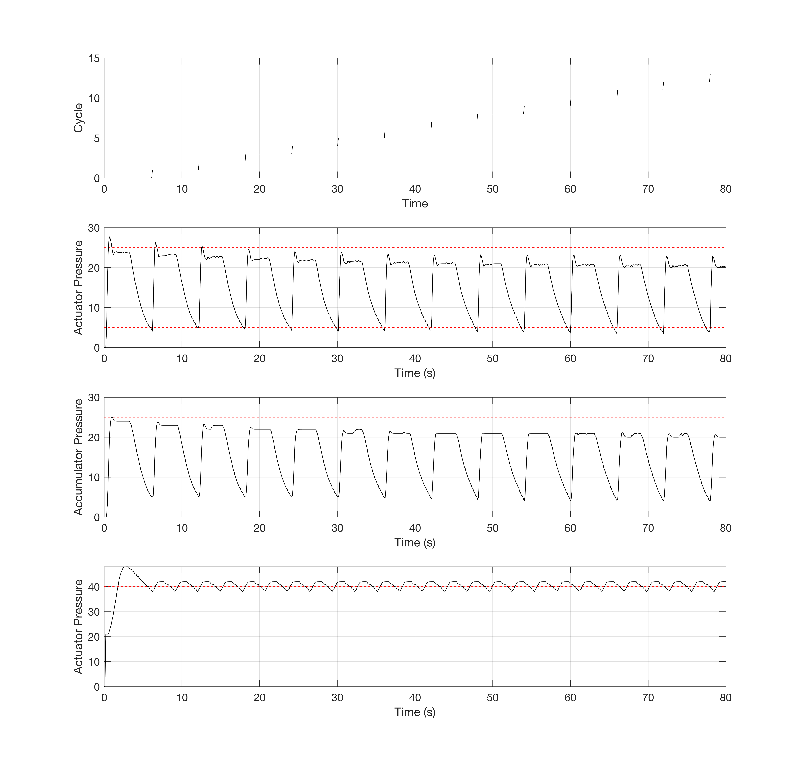

# RPI Interface for project.controller

This is the interfacing library for the controller implemented in the project.controller repository.
The interface is in C, for RaspberryPI using the wiringPI library.

## Installation

### Dependencies

 1. `sudo apt install build-essential git-core ruby ruby-ffi`
 2. wiringPi (follow installation instruction from the project page)

### Compile

```
make shared
```

## Communication object

The Ruby Object `SerialComm` allows a very simple communication with the device. When the object is created, it connects to the serial port specified as argument:

```
sc = SerialComm.new("/dev/ttyACM0")
```

the port is automatically closed when the GC frees the memory. The current information **must** be requested to the remote device with the `sc.update()` method, and it will require some time to receive all the information (at least two loops of the controller, meaning _60ms_).

The **write operations** are:

 * `sc.t_set = 0.0`: temperature set point
 * `sc.p_high = 0.0`: pressure top value
 * `sc.p_low = 0.0`: pressure bottom point
 * `sc.PI_kp = 0.0`: pressure PI control proportional gain
 * `sc.PI_ki = 0.0`: pressure PI control integrative gain
 * `sc.p_set = 0.0`: pressure current set point
 * `sc.period = 0.0`: square wave pressure period
 * `sc.duty_cycle = 0.0`: square wave pressure duty cycle
 * `sc.cycle = 0.0`: number of cycle performed
 * `sc.cycle_max = 0.0`: maximum number of cycle to perform
 * `sc.toggle_chiller`: chiller toggle enabling bit for temperature control
 * `sc.toggle_resistance`: resistance toggle enabling bit for temperature control
 * `sc.toggle_actuator`: actuator toggle enabling bit for pressure control

The **read operations** are (as floating point values):

 * `sc.t_meas` current measured temperature
 * `sc.p_actuator_meas`: measured actuator pressure
 * `p_accumulator_meas`: measured accumulator pressure
 * `PI_kp`: current pressure controller proportional gain
 * `PI_ki`: current pressure controller integrative gain
 * `t_set`: current temeprature set point
 * `p_set`: current pressure set point
 * `u_pres`: current input from PI for pressure
 * `duty_cycle`: current duty cycle value
 * `sc.cycle`: number of cycle performed
 * `sc.cycle_max`: maximum number of cycle to perform

(as boolean values)

 * `sc.chiller`: chiller enabled for temperature control
 * `sc.resistance`: resistance enabled for temperature control
 * `sc.actuator`: actuator enabled for pressure control

(as code symbol)

 * `sc.state`: execution state of the controller 
 * `sc.error`: error code of the controller (error string in `sc.error_string`)

The **EEPROM** operations are

 * `sc.save_config`: save configuration in the EEPROM
 * `sc.load_conf`: load configuration from the EEPROM
 * `sc.load_cycle`: load cycle value from the EEPROM (written automatically)

The **Execution** commands are:

 * `sc.play`: run the cycle
 * `sc.pause`: pause the cycle
 * `sc.stop`: emergency stop

## The example

The example `main.rb`, with the `SIL_SIM` option in the firmware, generates the following
output:



